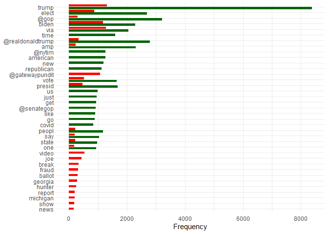
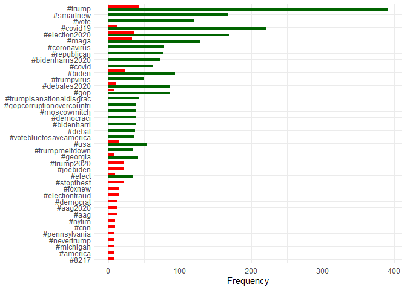
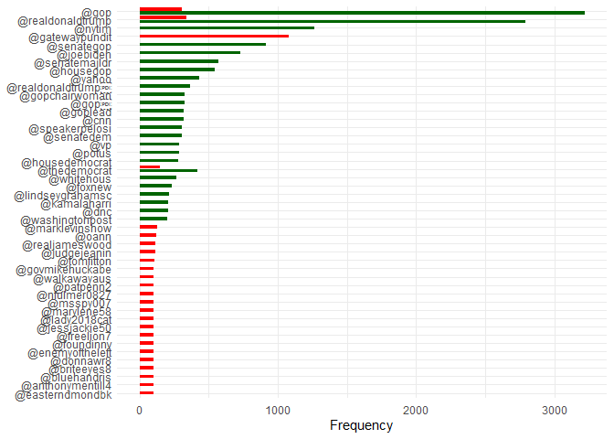
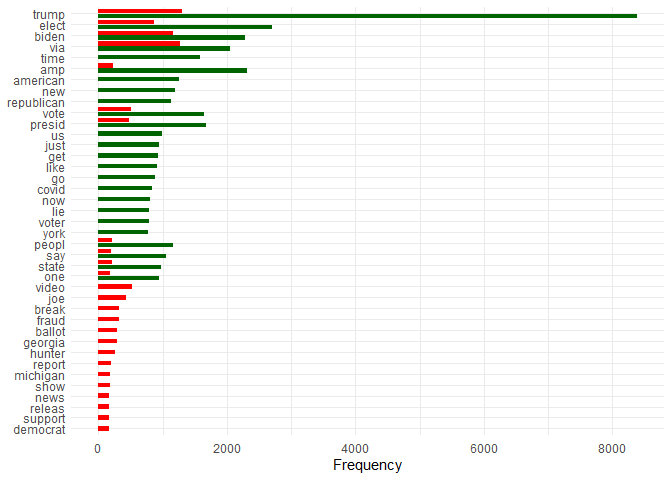
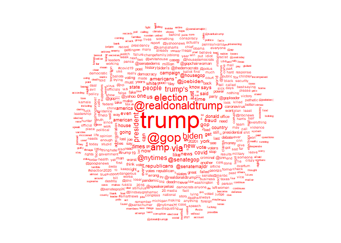
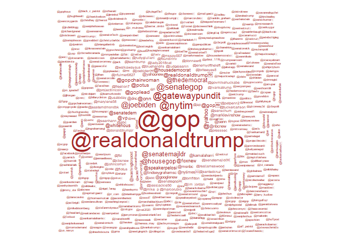
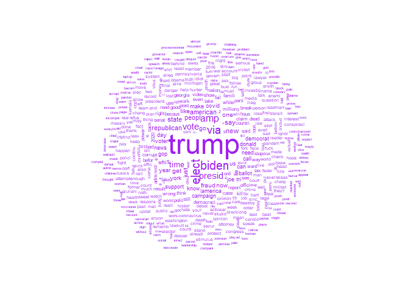

R Notebook
================

``` r
library(dplyr)
```

    ## 
    ## Attaching package: 'dplyr'

    ## The following objects are masked from 'package:stats':
    ## 
    ##     filter, lag

    ## The following objects are masked from 'package:base':
    ## 
    ##     intersect, setdiff, setequal, union

``` r
library(ggplot2)
library(wordcloud)
```

    ## Warning: package 'wordcloud' was built under R version 4.1.3

    ## Loading required package: RColorBrewer

``` r
library(text2vec)
```

    ## Warning: package 'text2vec' was built under R version 4.1.3

``` r
library(tm)
```

    ## Warning: package 'tm' was built under R version 4.1.3

    ## Loading required package: NLP

    ## Warning: package 'NLP' was built under R version 4.1.1

    ## 
    ## Attaching package: 'NLP'

    ## The following object is masked from 'package:ggplot2':
    ## 
    ##     annotate

``` r
##
library(quanteda)
```

    ## Warning: package 'quanteda' was built under R version 4.1.3

    ## Warning in .recacheSubclasses(def@className, def, env): undefined subclass
    ## "packedMatrix" of class "replValueSp"; definition not updated

    ## Warning in .recacheSubclasses(def@className, def, env): undefined subclass
    ## "packedMatrix" of class "mMatrix"; definition not updated

    ## Package version: 3.2.1
    ## Unicode version: 13.0
    ## ICU version: 69.1

    ## Parallel computing: 16 of 16 threads used.

    ## See https://quanteda.io for tutorials and examples.

    ## 
    ## Attaching package: 'quanteda'

    ## The following object is masked from 'package:tm':
    ## 
    ##     stopwords

    ## The following objects are masked from 'package:NLP':
    ## 
    ##     meta, meta<-

``` r
library(quanteda.textplots)
```

    ## Warning: package 'quanteda.textplots' was built under R version 4.1.3

``` r
library(quanteda.textstats)
```

    ## Warning: package 'quanteda.textstats' was built under R version 4.1.3

``` r
##
library(caret)
```

    ## Loading required package: lattice

``` r
library(MLeval)
```

    ## Warning: package 'MLeval' was built under R version 4.1.3

``` r
Sys.getlocale()
```

    ## [1] "LC_COLLATE=Portuguese_Portugal.1252;LC_CTYPE=Portuguese_Portugal.1252;LC_MONETARY=Portuguese_Portugal.1252;LC_NUMERIC=C;LC_TIME=Portuguese_Portugal.1252"

``` r
readr::guess_encoding('FN-Dataset-18k//FN-Dataset-18k.csv')
```

    ## # A tibble: 2 x 2
    ##   encoding     confidence
    ##   <chr>             <dbl>
    ## 1 UTF-8              1   
    ## 2 windows-1252       0.57

``` r
df = read.csv('FN-Dataset-18k//FN-Dataset-18k.csv',encoding = 'UTF-8') %>% 
  mutate(y = factor(questionable_domain))
```

# Tokenizing

``` r
corpus = quanteda::corpus(df$description)
tweets_tokens = quanteda::tokens(tolower(corpus),
                        remove_punct = TRUE,
                        split_hyphens = TRUE)

tweets_clean = tokens_wordstem(tweets_tokens) %>%
  dfm(., tolower = TRUE) %>% 
  dfm_remove(., stopwords("english"))

tweets_clean = tweets_clean[,order(featnames(tweets_clean))]

dfm = dfm(tweets_clean)

# subsets for EDA
hashtags = dfm_select(tweets_clean, pattern = '#*')
mention = dfm_select(tweets_clean, pattern = '@*')
normals = dfm_remove(tweets_clean, pattern = c('#*','@*'))
```

# EDA

``` r
pesquisa = dfm_select(tweets_clean, pattern = '#gop*')
pesquisa@Dimnames$features
```

    ##  [1] "#gop"                      "#gopbananarepubl"         
    ##  [3] "#gopbetrayedamerica"       "#gopbetraysamerica"       
    ##  [5] "#gopcheat"                 "#gopcomplicittraitor"     
    ##  [7] "#gopcorrupt"               "#gopcorruptionovercountri"
    ##  [9] "#gopcoup"                  "#gopcoward"               
    ## [11] "#gopcrim"                  "#gopcrimin"               
    ## [13] "#gopcrook"                 "#gopdbag"                 
    ## [15] "#gopdeathcult"             "#gopelit"                 
    ## [17] "#gopequalsli"              "#gopfail"                 
    ## [19] "#gopfailsamerica"          "#gopfailsdemocraci"       
    ## [21] "#gopfraud"                 "#gopgenocid"              
    ## [23] "#gophatesmilitari"         "#gophypocrisi"            
    ## [25] "#gophypocrit"              "#gopisdesper"             
    ## [27] "#gopkil"                   "#gopkillsus"              
    ## [29] "#gopli"                    "#gopracist"               
    ## [31] "#gopscumoftheearth"        "#gopseditionist"          
    ## [33] "#gopseditioustraitor"      "#gopsham"                 
    ## [35] "#gopsuperspread"           "#gopswamp"                
    ## [37] "#goptear"                  "#gopterrorist"            
    ## [39] "#goptraitor"               "#goptreason"              
    ## [41] "#goputin"                  "#gopvirus"                
    ## [43] "#gopvoterfraud"            "#gopvotersuppress"

## Initial Features

``` r
df %>% 
  filter(title != description) %>% 
  View

sum(df$title == df$description)
```

    ## [1] 17937

## Tokens

### Overall:

``` r
textstat_frequency(tweets_clean, n = 25, groups = df$questionable_domain) %>% 
  ggplot(aes(x=reorder(feature, frequency),
           y=frequency, fill=group)) +
  geom_bar(stat = "identity",
           position = position_dodge2(width = 0.9, preserve = "single")) +
  scale_fill_manual(values = c("darkgreen", "red")) +
  coord_flip() +
  labs(x=NULL, y = "Frequency") +
  theme_minimal() + 
  theme(legend.position = 'none')
```

<!-- -->

### Hashtags:

``` r
textstat_frequency(hashtags, n = 25, groups = df$questionable_domain) %>% 
  ggplot(aes(x=reorder(feature, frequency),
           y=frequency, fill=group)) +
  geom_bar(stat = "identity",
           position = position_dodge2(width = 0.9, preserve = "single")) +
  scale_fill_manual(values = c("darkgreen", "red")) +
  coord_flip() +
  labs(x=NULL, y = "Frequency") +
  theme_minimal() + 
  theme(legend.position = 'none')
```

<!-- -->

### Mentions:

``` r
textstat_frequency(mention, n = 25, groups = df$questionable_domain) %>% 
  ggplot(aes(x=reorder(feature, frequency),
           y=frequency, fill=group)) +
  geom_bar(stat = "identity",
           position = position_dodge2(width = 0.9, preserve = "single")) +
  scale_fill_manual(values = c("darkgreen", "red")) +
  coord_flip() +
  labs(x=NULL, y = "Frequency") +
  theme_minimal() + 
  theme(legend.position = 'none')
```

<!-- -->

### Normal words:

-   vermelho = TRUE, verde = FALSE;

``` r
textstat_frequency(normals, n = 25, groups = df$questionable_domain) %>% 
  ggplot(aes(x=reorder(feature, frequency),
           y=frequency, fill=group)) +
  geom_bar(stat = "identity",
           position = position_dodge2(width = 0.9, preserve = "single")) +
  scale_fill_manual(values = c("darkgreen", "red")) +
  coord_flip() +
  labs(x=NULL, y = "Frequency") +
  theme_minimal() + 
  theme(legend.position = 'none')
```

<!-- -->

### Groups derived

``` r
hash_t = c('#coronavirus', '#republican', '#bidenharris2020', '#covid', '#trumpvirus',
           '#trumpisanationaldisgrac', '#gopcorruptionovercountri','#moscowmitch', '#democraci',
           '#bidenharri', '#debat', '#votebluetosaveamerica')

hash_f = c('#trump2020', '#joebiden', '#stopthest', '#foxnew', '#electionfraud',
           '#democrat', '#aag2020', '#nytim', '#cnn', '#pennsylvania',
           '#nevertrump', '#michigan', '#america', '#8217')

mention_t = c('@senategop', '@joebiden', '@senatemajldr', '@housegop',
              '@yahoo', '@realdonaldtrump<U+2069>', '@gopchairwoman', '@gop<U+2069>',
              '@cnn', '@goplead', '@speakerpelosi', '@senatedem', '@vp', '@potus',
              '@whitehous', '@foxnew', '@lindseygrahamsc', '@kamalaharri', '@dnc',
              '@washingtonpost')

mention_f = c('@gatewaypundit', '@marklevinshow', '@oann', '@realjameswood', '@judgejeanin', '@tomfitton',
              '@govmikehuckabe', '@walkawayaus', '@patpenn2', '@nfulmer0827', '@msspy007',
              '@marylene58', '@lady2018cat', '@jessjackie50', '@freelion7', '@foundinnv',
              '@enemyoftheleft', '@donnawr8', '@briteeyes8', '@bluehandris', '@anthonymentill4',
              '@easterndmondbk')

norm_t = c('american', 'new', 'republican', 'us', 'just', 'get', 'like', 'go',
           'covid', 'now', 'lie', 'voter', 'york')

norm_f = c('video', 'joe', 'break', 'fraud', 'ballot', 'georgia',
           'hunter', 'report', 'michigan', 'show', 'news', 'releas', 'support',
           'democrat')
```

# Silly wordclouds

``` r
fake_news = df %>%
  filter(questionable_domain)
fake_news = quanteda::corpus(fake_news$description) %>% 
  quanteda::tokens(remove_punct = TRUE, split_hyphens = TRUE) %>% 
  dfm %>% 
  dfm_remove(., stopwords("english"))

textplot_wordcloud(fake_news)
```

<!-- -->

``` r
great_news = df %>%
  filter(!questionable_domain)
great_news = quanteda::corpus(great_news$description) %>% 
  quanteda::tokens(remove_punct = TRUE, split_hyphens = TRUE) %>% 
  dfm %>% 
  dfm_remove(., stopwords("english"))

textplot_wordcloud(great_news, color = 'red')
```

<!-- -->

``` r
textplot_wordcloud(hashtags, color = 'darkgreen')
```

    ## Warning in wordcloud(x, min_size, max_size, min_count, max_words, color, :
    ## #republicansaredestroyingamerica could not be fit on page. It will not be
    ## plotted.

    ## Warning in wordcloud(x, min_size, max_size, min_count, max_words, color, :
    ## #thursdaymorn could not be fit on page. It will not be plotted.

    ## Warning in wordcloud(x, min_size, max_size, min_count, max_words, color, :
    ## #trumpcrimefamilyforprison could not be fit on page. It will not be plotted.

    ## Warning in wordcloud(x, min_size, max_size, min_count, max_words, color, :
    ## #trumpgenocide2020 could not be fit on page. It will not be plotted.

    ## Warning in wordcloud(x, min_size, max_size, min_count, max_words, color, :
    ## #trumpisacoward could not be fit on page. It will not be plotted.

    ## Warning in wordcloud(x, min_size, max_size, min_count, max_words, color, :
    ## #trumpliespeopledi could not be fit on page. It will not be plotted.

    ## Warning in wordcloud(x, min_size, max_size, min_count, max_words, color, :
    ## #trumptaxfraud could not be fit on page. It will not be plotted.

    ## Warning in wordcloud(x, min_size, max_size, min_count, max_words, color, :
    ## #trumpviruscoverup could not be fit on page. It will not be plotted.

    ## Warning in wordcloud(x, min_size, max_size, min_count, max_words, color, :
    ## #trumpvirusdeathtoll220k could not be fit on page. It will not be plotted.

    ## Warning in wordcloud(x, min_size, max_size, min_count, max_words, color, :
    ## #usaelections2020 could not be fit on page. It will not be plotted.

    ## Warning in wordcloud(x, min_size, max_size, min_count, max_words, color, :
    ## #uselectionresults2020 could not be fit on page. It will not be plotted.

    ## Warning in wordcloud(x, min_size, max_size, min_count, max_words, color, :
    ## #voteredtosaveamerica could not be fit on page. It will not be plotted.

    ## Warning in wordcloud(x, min_size, max_size, min_count, max_words, color, :
    ## #vpdebate2020 could not be fit on page. It will not be plotted.

    ## Warning in wordcloud(x, min_size, max_size, min_count, max_words, color, :
    ## #whitesupremacist could not be fit on page. It will not be plotted.

    ## Warning in wordcloud(x, min_size, max_size, min_count, max_words, color, :
    ## #worstpresidentinhistori could not be fit on page. It will not be plotted.

    ## Warning in wordcloud(x, min_size, max_size, min_count, max_words, color, :
    ## #zerohedg could not be fit on page. It will not be plotted.

    ## Warning in wordcloud(x, min_size, max_size, min_count, max_words, color, :
    ## #counteverylegalvot could not be fit on page. It will not be plotted.

    ## Warning in wordcloud(x, min_size, max_size, min_count, max_words, color, :
    ## #electionintegr could not be fit on page. It will not be plotted.

    ## Warning in wordcloud(x, min_size, max_size, min_count, max_words, color, :
    ## #kamalaharrisvp could not be fit on page. It will not be plotted.

    ## Warning in wordcloud(x, min_size, max_size, min_count, max_words, color, :
    ## #pashinyan could not be fit on page. It will not be plotted.

    ## Warning in wordcloud(x, min_size, max_size, min_count, max_words, color, :
    ## #survivingrelativessuetrump could not be fit on page. It will not be plotted.

    ## Warning in wordcloud(x, min_size, max_size, min_count, max_words, color, :
    ## #votebymail could not be fit on page. It will not be plotted.

    ## Warning in wordcloud(x, min_size, max_size, min_count, max_words, color, :
    ## #whitesupremaci could not be fit on page. It will not be plotted.

<!-- -->

``` r
textplot_wordcloud(mention, color = 'brown')
```

    ## Warning in wordcloud(x, min_size, max_size, min_count, max_words, color, :
    ## @therightmelissa could not be fit on page. It will not be plotted.

    ## Warning in wordcloud(x, min_size, max_size, min_count, max_words, color, :
    ## @usagbarr could not be fit on page. It will not be plotted.

    ## Warning in wordcloud(x, min_size, max_size, min_count, max_words, color, :
    ## @congressdotgov could not be fit on page. It will not be plotted.

    ## Warning in wordcloud(x, min_size, max_size, min_count, max_words, color, :
    ## @democracynow could not be fit on page. It will not be plotted.

    ## Warning in wordcloud(x, min_size, max_size, min_count, max_words, color, :
    ## @drdenagrayson could not be fit on page. It will not be plotted.

    ## Warning in wordcloud(x, min_size, max_size, min_count, max_words, color, :
    ## @emmanuelmacron could not be fit on page. It will not be plotted.

    ## Warning in wordcloud(x, min_size, max_size, min_count, max_words, color, :
    ## @erictrump<U+2069> could not be fit on page. It will not be plotted.

    ## Warning in wordcloud(x, min_size, max_size, min_count, max_words, color, :
    ## @govwhitmer<U+2069> could not be fit on page. It will not be plotted.

    ## Warning in wordcloud(x, min_size, max_size, min_count, max_words, color, :
    ## @housejudiciari could not be fit on page. It will not be plotted.

    ## Warning in wordcloud(x, min_size, max_size, min_count, max_words, color, :
    ## @jim_jordan<U+2069> could not be fit on page. It will not be plotted.

    ## Warning in wordcloud(x, min_size, max_size, min_count, max_words, color, :
    ## @joetalkshow could not be fit on page. It will not be plotted.

    ## Warning in wordcloud(x, min_size, max_size, min_count, max_words, color, :
    ## @jonathanturley could not be fit on page. It will not be plotted.

    ## Warning in wordcloud(x, min_size, max_size, min_count, max_words, color, :
    ## @kelliwardaz could not be fit on page. It will not be plotted.

    ## Warning in wordcloud(x, min_size, max_size, min_count, max_words, color, :
    ## @marthamcs could not be fit on page. It will not be plotted.

    ## Warning in wordcloud(x, min_size, max_size, min_count, max_words, color, :
    ## @mcconnellpress could not be fit on page. It will not be plotted.

    ## Warning in wordcloud(x, min_size, max_size, min_count, max_words, color, :
    ## @parisdennard could not be fit on page. It will not be plotted.

    ## Warning in wordcloud(x, min_size, max_size, min_count, max_words, color, :
    ## @pastordscott could not be fit on page. It will not be plotted.

    ## Warning in wordcloud(x, min_size, max_size, min_count, max_words, color, :
    ## @pittsburghpg could not be fit on page. It will not be plotted.

    ## Warning in wordcloud(x, min_size, max_size, min_count, max_words, color, :
    ## @replouiegohmert could not be fit on page. It will not be plotted.

    ## Warning in wordcloud(x, min_size, max_size, min_count, max_words, color, :
    ## @reprashida could not be fit on page. It will not be plotted.

    ## Warning in wordcloud(x, min_size, max_size, min_count, max_words, color, :
    ## @repsforbiden could not be fit on page. It will not be plotted.

    ## Warning in wordcloud(x, min_size, max_size, min_count, max_words, color, :
    ## @reverendwarnock<U+2069> could not be fit on page. It will not be plotted.

    ## Warning in wordcloud(x, min_size, max_size, min_count, max_words, color, :
    ## @seanhannity<U+2069> could not be fit on page. It will not be plotted.

    ## Warning in wordcloud(x, min_size, max_size, min_count, max_words, color, :
    ## @senjudiciari could not be fit on page. It will not be plotted.

    ## Warning in wordcloud(x, min_size, max_size, min_count, max_words, color, :
    ## @stevescalis could not be fit on page. It will not be plotted.

    ## Warning in wordcloud(x, min_size, max_size, min_count, max_words, color, :
    ## @stltoday could not be fit on page. It will not be plotted.

    ## Warning in wordcloud(x, min_size, max_size, min_count, max_words, color, :
    ## @tomilahren could not be fit on page. It will not be plotted.

    ## Warning in wordcloud(x, min_size, max_size, min_count, max_words, color, :
    ## @tpinsidr could not be fit on page. It will not be plotted.

    ## Warning in wordcloud(x, min_size, max_size, min_count, max_words, color, :
    ## @vickie627 could not be fit on page. It will not be plotted.

    ## Warning in wordcloud(x, min_size, max_size, min_count, max_words, color, :
    ## @washtim could not be fit on page. It will not be plotted.

    ## Warning in wordcloud(x, min_size, max_size, min_count, max_words, color, :
    ## @bkmoore777 could not be fit on page. It will not be plotted.

    ## Warning in wordcloud(x, min_size, max_size, min_count, max_words, color, :
    ## @cocrow could not be fit on page. It will not be plotted.

    ## Warning in wordcloud(x, min_size, max_size, min_count, max_words, color, :
    ## @jah18186004 could not be fit on page. It will not be plotted.

    ## Warning in wordcloud(x, min_size, max_size, min_count, max_words, color, :
    ## @justin_hart could not be fit on page. It will not be plotted.

    ## Warning in wordcloud(x, min_size, max_size, min_count, max_words, color, :
    ## @sebgorka could not be fit on page. It will not be plotted.

    ## Warning in wordcloud(x, min_size, max_size, min_count, max_words, color, :
    ## @suprdup could not be fit on page. It will not be plotted.

    ## Warning in wordcloud(x, min_size, max_size, min_count, max_words, color, :
    ## @theworldwatch could not be fit on page. It will not be plotted.

    ## Warning in wordcloud(x, min_size, max_size, min_count, max_words, color, :
    ## @timcast could not be fit on page. It will not be plotted.

<!-- -->

``` r
textplot_wordcloud(normals, color = 'purple')
```

<!-- -->

# Transform tweets into features

``` r
featurizer = function(token, data){
  res = dfm_select(dfm, pattern = token)
  res = convert(res, to = 'data.frame')
  res = ifelse(res[,token] > 0, 1, 0) 
  res = cbind(data, res)
  names(res)[length(names(res))] = token
  return(res)
}

featurizer_group = function(group, group_id, data){
  # restricts to the desired tokens
  res = dfm_select(dfm, pattern = group)
  res = convert(res, to = 'data.frame')
  # calculates a group score: occurences / total
  res = rowSums(res[-1]/(length(group)))
  # attaches and format result:
  res = cbind(data, res)
  names(res)[length(names(res))] = group_id
  return(res)
}
```

## Some tokens:

``` r
df_ex = featurizer('@gop', df) %>% 
  featurizer('biden',.) %>% 
    featurizer('trump',.) %>%
  featurizer('elect',.) %>% 
  featurizer('@gatewaypundit',.) %>% 
  featurizer_group(hash_f, 'hash_f',.) %>% 
  featurizer_group(hash_t, 'hash_t',.) %>% 
  featurizer_group(mention_t, 'mention_t',.) %>% 
  featurizer_group(mention_f, 'mention_f',.) %>% 
  featurizer_group(norm_t, 'norm_t',.) %>% 
  featurizer_group(norm_f, 'norm_f',.)
```

## Test - Train split

### Option 1: Blind partition:

``` r
index = caret::createDataPartition(df$questionable_domain, p = 0.2, list = F)
train = df_ex[index,]
test = df_ex[-index,]
```

### Option 2: Restructure dataset:

``` r
set.seed(123)
# true tweets:
index_t = which(df$questionable_domain)

# false tweets:
index_f = which(!df$questionable_domain) %>% 
  sample(6000)

index_r = c(index_t,index_t,index_f)

df_ex_r = df_ex[index_r,]
index = caret::createDataPartition(df_ex_r$questionable_domain, p = 0.2, list = F)

train = df_ex_r[-index,]
test = df_ex_r[index,]
```

## Models fit

``` r
# common parameters:
y = test$questionable_domain

# modelo = as.formula(factor(y) ~ factor(user_verified) + factor(contains_profanity))

modelo = as.formula(factor(y) ~ factor(user_verified) + factor(contains_profanity) +
                      factor(`@gop`) + factor(biden) + factor(trump) + factor(elect) +
                      factor(`@gatewaypundit`) +
                      hash_f + hash_t + mention_f + mention_t + norm_f + norm_t)

ctrl = trainControl(method = "cv",
                      number = 10,
                      savePredictions = T)

# model-specific grid:
grelha = expand.grid(mtry = c(1,2,5,10,20,30,40,50))
```

## Naive Bayes

``` r
model_nb = train(modelo,
                 data = train,
                 method = "naive_bayes",
                 trControl = ctrl)

model_nb
```

    ## Naive Bayes 
    ## 
    ## 9600 samples
    ##   13 predictor
    ##    2 classes: 'FALSE', 'TRUE' 
    ## 
    ## No pre-processing
    ## Resampling: Cross-Validated (10 fold) 
    ## Summary of sample sizes: 8640, 8640, 8640, 8640, 8640, 8640, ... 
    ## Resampling results across tuning parameters:
    ## 
    ##   usekernel  Accuracy   Kappa    
    ##   FALSE      0.7273958  0.4547917
    ##    TRUE      0.7052083  0.4104167
    ## 
    ## Tuning parameter 'laplace' was held constant at a value of 0
    ## Tuning
    ##  parameter 'adjust' was held constant at a value of 1
    ## Accuracy was used to select the optimal model using the largest value.
    ## The final values used for the model were laplace = 0, usekernel = FALSE
    ##  and adjust = 1.

``` r
confusionMatrix(model_nb, mode = 'everything')
```

    ## Cross-Validated (10 fold) Confusion Matrix 
    ## 
    ## (entries are percentual average cell counts across resamples)
    ##  
    ##           Reference
    ## Prediction FALSE TRUE
    ##      FALSE  48.7 26.0
    ##      TRUE    1.3 24.0
    ##                             
    ##  Accuracy (average) : 0.7274

## Random Forest

``` r
# corremos a simulação
model_rf = caret::train(modelo,
                     method="rf",
                     data=train,
                     trControl=ctrl,
                     #tuneGrid=grelha,
                     #preProc=c("BoxCox"),
                     ntree=100)


print(model_rf)
```

    ## Random Forest 
    ## 
    ## 9600 samples
    ##   13 predictor
    ##    2 classes: 'FALSE', 'TRUE' 
    ## 
    ## No pre-processing
    ## Resampling: Cross-Validated (10 fold) 
    ## Summary of sample sizes: 8640, 8640, 8640, 8640, 8640, 8640, ... 
    ## Resampling results across tuning parameters:
    ## 
    ##   mtry  Accuracy   Kappa    
    ##    2    0.7745833  0.5491667
    ##    7    0.7770833  0.5541667
    ##   13    0.7754167  0.5508333
    ## 
    ## Accuracy was used to select the optimal model using the largest value.
    ## The final value used for the model was mtry = 7.

``` r
model_rf$finalModel
```

    ## 
    ## Call:
    ##  randomForest(x = x, y = y, ntree = 100, mtry = min(param$mtry,      ncol(x))) 
    ##                Type of random forest: classification
    ##                      Number of trees: 100
    ## No. of variables tried at each split: 7
    ## 
    ##         OOB estimate of  error rate: 22.12%
    ## Confusion matrix:
    ##       FALSE TRUE class.error
    ## FALSE  4138  662   0.1379167
    ## TRUE   1462 3338   0.3045833

``` r
model_rf$results
```

    ##   mtry  Accuracy     Kappa AccuracySD    KappaSD
    ## 1    2 0.7745833 0.5491667 0.01479020 0.02958040
    ## 2    7 0.7770833 0.5541667 0.01005147 0.02010294
    ## 3   13 0.7754167 0.5508333 0.01005387 0.02010773

## SVM

``` r
model_svm =
train(modelo,
      data = train,
      method = "svmLinear",
      control = ctrl)

model_svm$finalModel
```

    ## Support Vector Machine object of class "ksvm" 
    ## 
    ## SV type: C-svc  (classification) 
    ##  parameter : cost C = 1 
    ## 
    ## Linear (vanilla) kernel function. 
    ## 
    ## Number of Support Vectors : 4994 
    ## 
    ## Objective Function Value : -4963.085 
    ## Training error : 0.230938

``` r
model_svm$pred
```

    ## NULL

``` r
print(model_svm)
```

    ## Support Vector Machines with Linear Kernel 
    ## 
    ## 9600 samples
    ##   13 predictor
    ##    2 classes: 'FALSE', 'TRUE' 
    ## 
    ## No pre-processing
    ## Resampling: Bootstrapped (25 reps) 
    ## Summary of sample sizes: 9600, 9600, 9600, 9600, 9600, 9600, ... 
    ## Resampling results:
    ## 
    ##   Accuracy   Kappa    
    ##   0.7678208  0.5348577
    ## 
    ## Tuning parameter 'C' was held constant at a value of 1

``` r
confusionMatrix(model_svm)
```

    ## Bootstrapped (25 reps) Confusion Matrix 
    ## 
    ## (entries are percentual average cell counts across resamples)
    ##  
    ##           Reference
    ## Prediction FALSE TRUE
    ##      FALSE  45.7 18.6
    ##      TRUE    4.6 31.1
    ##                             
    ##  Accuracy (average) : 0.7678

``` r
confusionMatrix(predict(model_svm, newdata = test),
                factor(test$questionable_domain),
                mode = 'everything')
```

    ## Confusion Matrix and Statistics
    ## 
    ##           Reference
    ## Prediction FALSE TRUE
    ##      FALSE  1085  451
    ##      TRUE    115  749
    ##                                          
    ##                Accuracy : 0.7642         
    ##                  95% CI : (0.7467, 0.781)
    ##     No Information Rate : 0.5            
    ##     P-Value [Acc > NIR] : < 2.2e-16      
    ##                                          
    ##                   Kappa : 0.5283         
    ##                                          
    ##  Mcnemar's Test P-Value : < 2.2e-16      
    ##                                          
    ##             Sensitivity : 0.9042         
    ##             Specificity : 0.6242         
    ##          Pos Pred Value : 0.7064         
    ##          Neg Pred Value : 0.8669         
    ##               Precision : 0.7064         
    ##                  Recall : 0.9042         
    ##                      F1 : 0.7931         
    ##              Prevalence : 0.5000         
    ##          Detection Rate : 0.4521         
    ##    Detection Prevalence : 0.6400         
    ##       Balanced Accuracy : 0.7642         
    ##                                          
    ##        'Positive' Class : FALSE          
    ## 

## LDA

``` r
model_lda = train(modelo,
                  data=train,
                  method="lda",
                  trControl = ctrl)

model_lda
```

    ## Linear Discriminant Analysis 
    ## 
    ## 9600 samples
    ##   13 predictor
    ##    2 classes: 'FALSE', 'TRUE' 
    ## 
    ## No pre-processing
    ## Resampling: Cross-Validated (10 fold) 
    ## Summary of sample sizes: 8640, 8640, 8640, 8640, 8640, 8640, ... 
    ## Resampling results:
    ## 
    ##   Accuracy   Kappa    
    ##   0.7708333  0.5416667

## QDA - rank deficiency

``` r
model_qda = train(modelo,
                  data=train,
                  method="qda",
                  trControl = ctrl)
```

    ## Warning: model fit failed for Fold02: parameter=none Error in qda.default(x, grouping, ...) : rank deficiency in group FALSE

    ## Warning in nominalTrainWorkflow(x = x, y = y, wts = weights, info = trainInfo, :
    ## There were missing values in resampled performance measures.

``` r
model_qda
```

    ## Quadratic Discriminant Analysis 
    ## 
    ## 9600 samples
    ##   13 predictor
    ##    2 classes: 'FALSE', 'TRUE' 
    ## 
    ## No pre-processing
    ## Resampling: Cross-Validated (10 fold) 
    ## Summary of sample sizes: 8640, 8640, 8640, 8640, 8640, 8640, ... 
    ## Resampling results:
    ## 
    ##   Accuracy  Kappa    
    ##   0.749537  0.4990741

## Evaluation

``` r
# https://intobioinformatics.wordpress.com/2019/11/26/how-to-easily-make-a-roc-curve-in-r/

#notas = evalm(list(model_rf, model_svm), gnames=c('rf','svm'))
```

# PREDICT NEW TWEETS

df\_ex = featurizer(‘@gop’, df) %&gt;% featurizer(‘biden’,.) %&gt;%
featurizer(‘trump’,.) %&gt;% featurizer(‘elect’,.) %&gt;%
featurizer(‘@gatewaypundit’,.) %&gt;% featurizer\_group(hash\_f,
‘hash\_f’,.) %&gt;% featurizer\_group(hash\_t, ‘hash\_t’,.) %&gt;%
featurizer\_group(mention\_t, ‘mention\_t’,.) %&gt;%
featurizer\_group(mention\_f, ‘mention\_f’,.) %&gt;%
featurizer\_group(norm\_t, ‘norm\_t’,.) %&gt;%
featurizer\_group(norm\_f, ‘norm\_f’,.)

``` r
# pre-processing function
conversor = function(new, ml_model){
  temp = quanteda::corpus(new$description)
  tokens = quanteda::tokens(temp,
                        remove_punct = TRUE,
                        split_hyphens = TRUE)
  # builds output
  predictable = new %>% 
    mutate(`@gop` = ifelse('@gop' %in% tokens, 1,0),
           biden = ifelse('biden' %in% tokens, 1,0),
           elect = ifelse('elect' %in% tokens, 1,0),
           `@gatewaypundit`= ifelse('@gatewaypundit' %in% tokens, 1,0),
           hash_f = sum())
  
  
  if(ml_model == 'rf'){
      output = predict(model_rf, newdata = predictable)
  }
  else if(ml_model == 'svm'){
    output = predict(model_svm, newdata = predictable)
  }
  
  return(output)
}

# create dummy tweets
dummy = df[3,]

conversor(dummy, 'rf')
```
